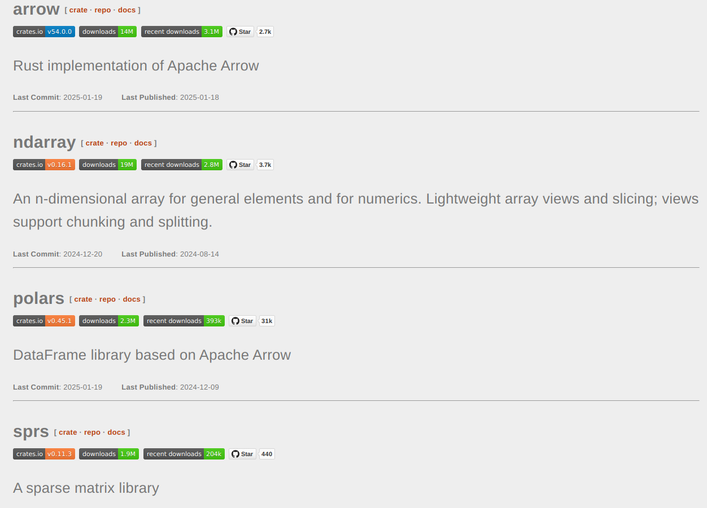
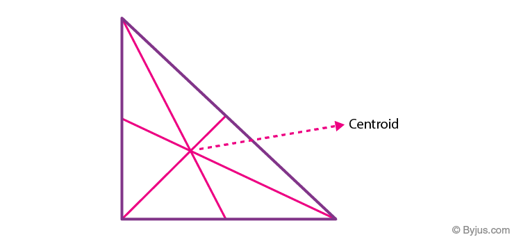

Intro
---
- Hi there! I'm Luciano (_lu-cha-no_)

<!--new_line-->
<!--pause-->
- I'm passionate about data and programming
<!--new_line-->
<!--pause-->
- I love learning new things and sharing knowledge with others
<!--new_line-->
<!--pause-->
- Currently working for a consultancy company in aviation
<!--new_line-->
<!--pause-->
- Actively working in open source and exploring Rust to enhance efficiency
<!-- end_slide -->


The state of Data science in Rust
---
<!--pause-->
_"Are we data science yet?"_
==
<!--pause-->

_https://www.arewelearningyet.com/data-structures/_

<!--end_slide-->


The state of Data science in Rust
---
* Currently there are not many crates for data science in Rust
<!--new_line-->
<!--pause-->
* Arrow - The universal columnar format and multi-language toolbox for fast data interchange and in-memory analytics
<!--new_line-->
<!--pause-->
* **Polars** - Dataframes powered by a multithreaded, vectorized query engine, written in Rust
<!--end_slide-->


Some exciting features about Polars
---
Polars is one of the fastest data science tools that is built on top of Apache Arrow and written in Rust. It more memory efficient than Pandas.
<!-- incremental_lists: true -->
* Native columnar data storage
* Lazy API
* Multi-threaded out of the box
* _Cheap_ Copy-on-Write
* Query plan optimization
    * Predicate pushdown
    * Projection pushdown
    * Aggregate pushdown
<!--end_slide-->


Dataframes and Column oriented storage
---
A Dataframe in polars is a collection of Series (columns) of equal length. Each column has a name and a single data type.
<!--new_line-->
```
┌────────────┬─────┬────────────┬──────┐
│ timestamp  ┆ id  ┆ name       ┆ age  │
│ ---        ┆ --- ┆ ---        ┆ ---  │
│ date       ┆ i64 ┆ str        ┆ i32  │
╞════════════╪═════╪════════════╪══════╡
│ 2023-01-01 ┆ 1   ┆ John Doe   ┆ 25   │
│ 2023-01-02 ┆ 2   ┆ Jane Doe   ┆ 30   │
│ 2023-01-03 ┆ 3   ┆ Bob Smith  ┆ 45   │
└────────────┴─────┴────────────┴──────┘
```
<!--end_slide-->


Column oriented storage
---
<!--new_line-->
Columnar storage is efficient because:

<!-- incremental_lists: true -->
* Better compression - Similar values stored together compress better
* Cache efficiency - Accessing columns keeps data local in memory
* Query optimization - Only reading needed columns reduces I/O
* SIMD operations - Vector operations can process entire columns at once
* Memory efficiency - No need to read unused columns

<!--end_slide-->


Lazy vs Eager
---
<!--new_line-->
- **Eager Evaluation**
```
  ───▶ Load Data ───▶ Filter ───▶ GroupBy ───▶ Sort ───▶ Result
```
  Executed immediately step by step

<!--new_line-->
- **Lazy Evaluation**
```
  Load Data ─┐
  Filter    ─┤
  GroupBy   ─┼───▶ Optimize ───▶ Execute ───▶ Result
  Sort      ─┘
```
Plan built first, then optimized & executed
<!--end_slide-->


Show time!: Buildings in Hong Kong
--

<!--end_slide-->


<!--end_slide-->

```json {2-4|5-7|9}
{
"type": "FeatureCollection",
"name": "Buildings_in_Hong_Kong",
"crs": { "type": "name", "properties": { "name": "urn:ogc:def:crs:OGC:1.3:CRS84" } },
"features": [
{ "type": "Feature",
  "properties": {
    "OBJECTID": 1, "BUILDINGSTRUCTUREID": 5243561, "BUILDINGCSUID": "0162608928T20071224", "BUILDINGSTRUCTURETYPE": "T", "CATEGORY": "5", "STATUS": "A", "STATUSDATE": null, "OFFICIALBUILDINGNAMEEN": null, "OFFICIALBUILDINGNAMETC": null, "NUMABOVEGROUNDSTOREYS": null, "NUMBASEMENTSTOREYS": null, "TOPHEIGHT": null, "BASEHEIGHT": null, "GROSSFLOORAREA": null, "RECORDCREATIONDATE": "2007-12-24T00:00:00Z", "RECORDUPDATEDDATE": "2008-01-16T00:00:00Z", "SHAPE__Area": 16.947265625, "SHAPE__Length": 18.893572763678002 },
  "geometry": { "type": "Polygon", "coordinates": ... } },
...]
```

<!--pause-->
This file has 400K features.

<!--end_slide-->


Eager API
--
```rust {1-11|1|8|11}
use polars::prelude::*;
use polars_demo::{load_data, unnest_df};

fn main() -> Result<(), Box<dyn std::error::Error>> {
    let path = std::env::temp_dir().join("hk_buildings.json");
    load_data(&path)?;
    let file = std::fs::File::open(path)?;
    let mut df = JsonReader::new(file).finish()?.select(["features"])?;
    df = unnest_df(&df)?;
    println!("{:?}", df);
    println!("{:?}", df.column("RECORDCREATIONDATE")?);
}


```
<!--end_slide-->


Eager API
--
Let's find out how many building _records_ were created over the years!
<!--end_slide-->


Eager API
--
We can create or modify existing columns!

```rust {1|1-2|1-3|1-11|1-12|1-14|1-16}
df.with_column(
    df.column("RECORDCREATIONDATE")?
        .str()?
        .as_datetime(
            Some("%FT%H:%M:%SZ"),
            TimeUnit::Nanoseconds,
            true,
            false,
            None,
            &ambiguous,
        )?
        .year()
        .with_name("creation_year".into()),
)?;

println!("{:?}", df.column("creation_year")?);
```
<!--end_slide-->


Eager API
--
```rust {3|3-4|3-5|3-9}
println!(
    "{:?}",
    df.group_by(["creation_year"])?
        .select(["OBJECTID"])
        .count()?
        .sort(
            ["OBJECTID_count"],
            SortMultipleOptions::default().with_order_descending(true)
        )
);
```
<!--end_slide-->


Eager API
--

```
┌───────────────┬────────────────┐
│ creation_year ┆ OBJECTID_count │
│ ---           ┆ ---            │
│ i32           ┆ u32            │
╞═══════════════╪════════════════╡
│ 2005          ┆ 204182         │
│ 2008          ┆ 74603          │
│ 2007          ┆ 27891          │
│ 2009          ┆ 10094          │
│ 2006          ┆ 10088          │
│ …             ┆ …              │
│ 2015          ┆ 6010           │
│ 2016          ┆ 4900           │
│ 2020          ┆ 4804           │
│ 2004          ┆ 1567           │
│ 2022          ┆ 1164           │
└───────────────┴────────────────┘
```
<!--end_slide-->


How can we make this faster (Lazy API)
--
The Lazy API in Polars can provide significant performance improvements over eager evaluation by:

<!-- incremental_lists: true -->
* Building a query plan first instead of executing operations immediately
* Allowing the query optimizer to analyze and improve the entire plan
* Pushing predicates down to minimize data read
* Minimizing intermediate allocations
* Parallelizing operations when possible
* Only loading required columns from disk
* Combining multiple operations into optimized steps

<!--end_slide-->


How can we make this faster (Lazy API)
--
```rust
lf = lf.with_column(
    col("RECORDCREATIONDATE")
        .str()
        .strptime(
            DataType::Datetime(TimeUnit::Milliseconds, None),
            StrptimeOptions {
                format: Some("%FT%H:%M:%SZ".into()),
                strict: false,
                exact: true,
                cache: false,
            },
            lit("raise"),
        )
        .dt()
        .year()
        .alias("creation_year"),
)
.group_by(["creation_year"])
.agg([col("OBJECTID").count()])
.sort(
    ["OBJECTID"],
    SortMultipleOptions::default().with_order_descending(true),
)
.collect()?;
```
<!--new_line-->
This builds an optimized plan before executing, rather than processing step-by-step.
<!--end_slide-->


Centroid
--


<!--end_slide-->

We can add native Rust function to our Polars code!
--

```rust
use geo::{Centroid, Polygon};

fn calculate_centroid(coords: Vec<Vec<f64>>) -> Option<(f64, f64)> {
    let polygon = Polygon::new(
        geo::LineString::from(
            coords
                .into_iter()
                .map(|coord| (coord[0], coord[1]))
                .collect::<Vec<_>>(),
        ),
        vec![],
    );

    polygon
        .centroid()
        .map(|centroid| (centroid.x(), centroid.y()))
}
```

<!--end_slide-->


Why Polars in Rust for Production?
---
<!-- incremental_lists: true -->
* **Performance & Resources**
    * Blazing fast query execution
    * Memory efficient with zero-copy operations
    * Native multi-threading support
    * Perfect for resource-constrained environments

* **Production Ready**
    * Strong type system prevents runtime errors
    * Excellent error handling with Result type
    * Cross-platform compatibility

* **Backend Integration**


```rust
// Example with Actix-web
use actix_web::{get, web, App, HttpServer, Result};
use polars::prelude::*;

#[get("/buildings/stats")]
async fn building_stats() -> Result<web::Json<Value>> {
    let lf = LazyFrame::scan_parquet(
        "data.parquet",
        ScanArgsParquet::default()
    )?
    .group_by(["category"])
    .agg([col("height").mean()])
    .collect()?;

    Ok(web::Json(lf.to_json()?))
}
```

<!--end_slide-->


Why Polars in Rust for Production?
---
<!-- incremental_lists: true -->
* **Versatile Data Pipeline Building**
    * Read/Write multiple formats (Parquet, CSV, JSON)
    * Easy integration with Arrow ecosystem
    * Stream processing capabilities
    * Excellent for ETL workflows

* **Developer Experience**
    * Familiar DataFrame API
    * Great documentation and growing community
    * IDE support with type hints
    * Easy to test and benchmark

* **Real-world Use Cases**
    * Data APIs and Microservices
    * Real-time analytics
    * ETL Pipelines
    * Machine Learning Feature Engineering
    * IoT Data Processing


<!--end_slide-->
